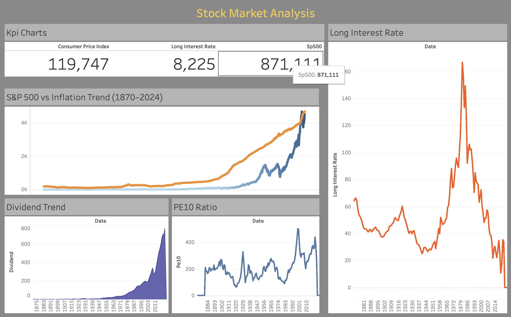

# 📊 Stock Market vs Inflation Dashboard (1870–2024)

An interactive financial dashboard built using **Tableau** to analyze the long-term relationship between the stock market and inflation.

This project highlights how **macroeconomic factors like CPI and interest rates** influence market performance over time and emphasizes the importance of long-term investing.

---

## 📌 Project Overview

Financial markets are influenced by multiple economic indicators, but one key question remains:

👉 Does the stock market actually beat inflation in the long run?

This dashboard explores:
- Stock market growth over 150+ years 📈  
- Inflation trends using CPI 📊  
- Interest rate fluctuations 📉  
- Investment indicators like Dividend & PE10 ratio 📌  

The objective is to provide a clear, visual understanding of how economic factors shape market behavior over time.

---

## 🚀 Key Features

✔️ Long-term S&P 500 trend analysis  
✔️ Stock market vs inflation comparison (CPI)  
✔️ Interest rate trend visualization  
✔️ KPI indicators for quick insights  
✔️ Dividend and PE10 ratio analysis  
✔️ Clean and interactive dashboard design  

---

## 🛠️ Tools Used

- 📊 Tableau  
- 📈 Data Visualization  
- 📉 Financial Data Analysis  

---

## 📂 Dataset Information

The dataset used in this project was sourced from a public GitHub repository containing historical financial data.

### Features included:
- S&P 500 Index  
- Consumer Price Index (CPI)  
- Long-term Interest Rates  
- Dividends  
- PE10 Ratio  

### Data Preparation:
- Handling missing values  
- Formatting date columns for time-series analysis  

---

## 📊 Dashboard Preview

> Replace **dashboard.png** with your actual image file name  
> (Example: stock_dashboard.png)

---

## 🌐 Live Dashboard

👉 https://public.tableau.com/app/profile/karishma.s8771/viz/StockMarketAnalysisDashboard_17761463714560/StockMarketAnalysis?publish=yes  

---

## 🎯 Key Insights

- 📈 The stock market has consistently outperformed inflation over the long term  
- 📊 Inflation impacts short-term market fluctuations  
- 📉 Interest rate changes influence market trends  
- 📌 Long-term investing reduces the impact of volatility  

---

## 💡 Conclusion

This dashboard demonstrates how macroeconomic indicators affect financial markets and reinforces the importance of long-term investment strategies.

---

## 👩‍💻 Author

Karishma S  
Data Analytics Enthusiast  

---

## ⭐ If you like this project

Give it a ⭐ on GitHub and share your feedback!

---

## 📬 Contact

LinkedIn: https://www.linkedin.com/in/karishma-s-a080ab315/  

Feel free to connect for collaboration or opportunities 🚀
